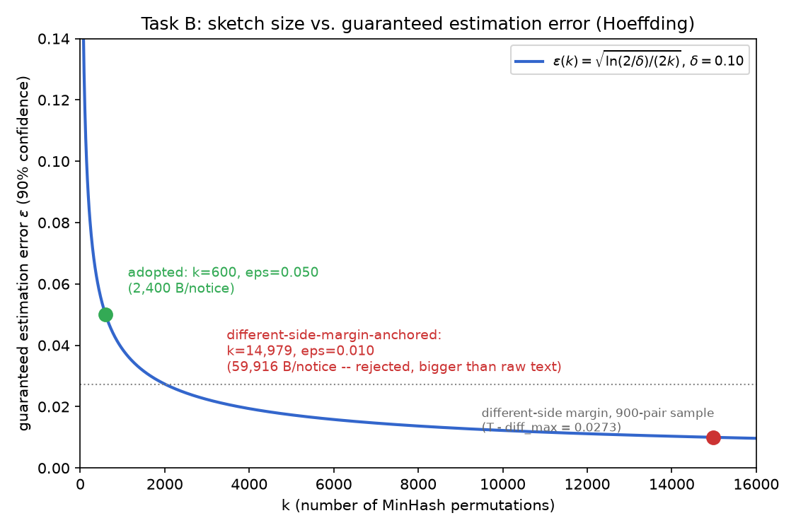
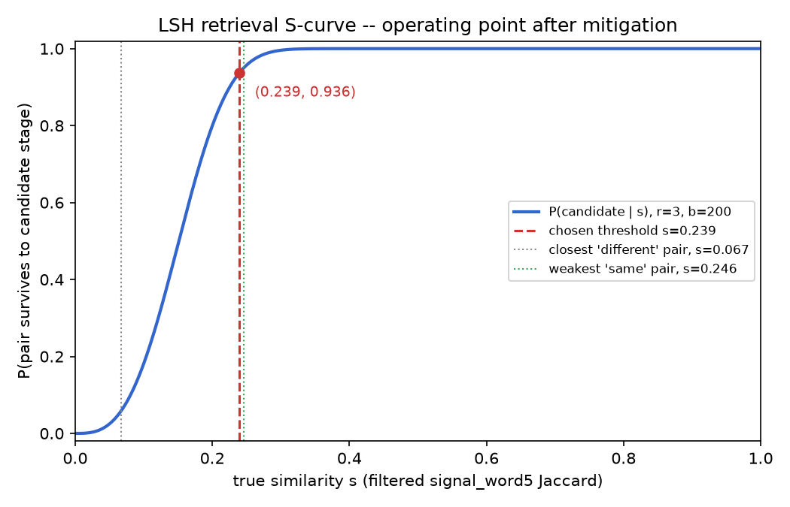
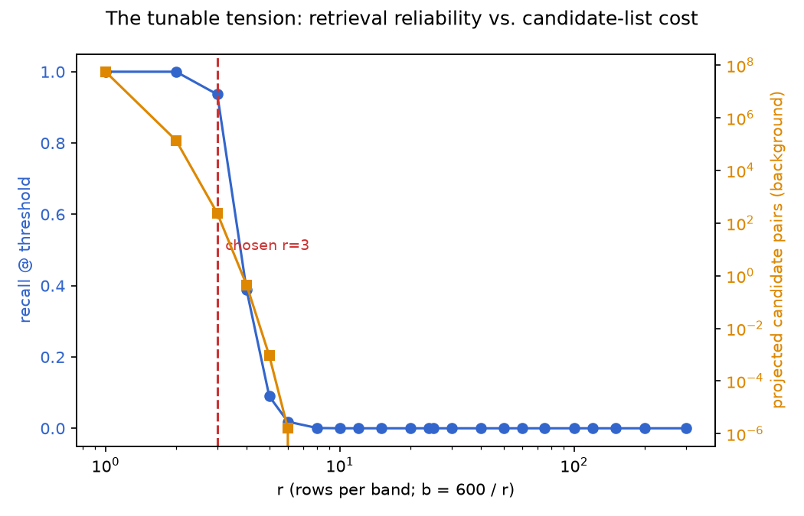

# Question 2 -- SetuBid dedup: decisions and evidence

Part of the [Lab 1 submission](../../README.md); see that index for
Question 1 (Annapurna Stores, `../question1/README.md`).

Working notes for the tasks below. Code lives in `authored/` and is
runnable directly against the provided data (`notices/`, `labelled_pairs.csv`)
with the standard library only -- no pandas/numpy, so it also demonstrates
the "one machine, no exotic deps" constraint from the brief rather than
fighting it.

```
question2/
  notices/               (provided)  12,000 notices, 260 portals
  labelled_pairs.csv      (provided)  900 human-adjudicated pairs (279 same / 621 different)
  portal_profiles.md      (provided)  scraping team's notes on portal quirks
  _truth/                 (provided)  grader answer key -- not read by any script below
  authored/
    load.py                (authored)  loads notices/*.csv and labelled_pairs.csv
    reduce.py               (authored)  Task A: turns a notice into a shingle set, 3 competing modes
    task_a_separation.py     (authored)  Task A: scores all 900 pairs under each mode, reports AUC
    task_a_threshold.py      (authored)  Task A: turns the cost ratio into a single numeric threshold
    minhash.py               (authored)  Task B: fixed-size MinHash sketch + the k-from-(epsilon,delta) argument
    task_b_minhash.py        (authored)  Task B: builds sketches, measures realised error, checks decision flips
    build_sketches.py        (authored)  Task C: caches (exact set, k=600 sketch) per notice to disk -- 190s once
    lsh.py                   (authored)  Task C: band/bucket a MinHash sketch, closed-form S-curve
    task_c_lsh.py             (authored)  Task C: background-calibrated (r,b) grid, real random-pair sampling
    task_c_build_index.py     (authored)  Task C: builds the real candidate index over all 12,000 notices
    task_b_plot.py             (authored)  Task B: the Hoeffding epsilon(k) plot (needs the venv -- see note)
    task_c_mitigation.py      (authored)  Task E: the document-frequency stoplist fix + full re-measurement
    task_c_plot.py            (authored)  Task E: the S-curve + tension plots for the final scheme (needs the venv)
    task_e_distribution.py     (authored)  Task E: work-distribution-across-notices check on the final scheme
    schema.sql                (authored)  Task D: the lsh_bands table + both candidate indexes
    load_bands.py             (authored)  Task D: dumps the mitigated LSH index to bands.csv
    explain_lookup.sql        (authored)  Task D: the three EXPLAIN (ANALYZE, BUFFERS) comparisons
    docker-compose.yml        (authored)  Task D: standalone Postgres for this question (port 5433)
```

matplotlib isn't stdlib, so `task_c_plot.py` needs the one-time venv:

```
cd data-mining-lab-1/question2
python3 -m venv --without-pip .venv
curl -sS https://bootstrap.pypa.io/get-pip.py | ./.venv/bin/python3 -
./.venv/bin/pip install matplotlib
```

Run in order:

```
cd data-mining-lab-1/question2/authored
python3 task_a_separation.py
python3 task_a_threshold.py
python3 task_b_minhash.py
python3 build_sketches.py
python3 task_c_lsh.py
python3 task_c_build_index.py
python3 task_c_mitigation.py
python3 task_e_distribution.py
../.venv/bin/python3 task_c_plot.py
../.venv/bin/python3 task_b_plot.py

# Task D -- needs Docker
docker compose up -d
python3 load_bands.py
docker exec -i setubid-postgres psql -U setubid -d setubid -f - < schema.sql
docker exec -i setubid-postgres psql -U setubid -d setubid -c \
  "\copy lsh_bands(notice_id,band_idx,k1,k2,k3) FROM STDIN WITH (FORMAT csv)" < bands.csv
docker exec -i setubid-postgres psql -U setubid -d setubid -f - < explain_lookup.sql
```

Every number quoted below is this run's actual output, not a guess at what
it should be.

---

## Task A -- what "similar" means here

### The candidates

A notice becomes comparable once it's turned into a set (shingles), over
which Jaccard similarity is well defined. Two decisions drive that
conversion, and both are visible as separate axes in `reduce.py`:

1. **Granularity** -- how finely the text is decomposed before shingling:
   whole-word 5-grams vs. character 8-grams.
2. **Signal vs. noise** -- whether the shingle set is built from the raw
   scraped text, or from a version with portal boilerplate, reference
   numbers and money/date formatting stripped out first.

Three representations, all implemented in `reduce.py::represent()`:

| mode | granularity | signal/noise decision |
|---|---|---|
| `raw_word5` | word 5-grams | none -- full raw `title + body` |
| `signal_word5` | word 5-grams | preamble/disclaimer/BOQ/dates/contact/reference-number stripped |
| `signal_char8` | char 8-grams | same stripping as above, finer decomposition |

### Evidence for the signal/noise split

Pulled two real corpus samples before writing any stripping code
(`portal_profiles.md` plus direct inspection of `notices/*.csv`):

- **Portal preamble is boilerplate, not content.** `P001`'s "STANDARD
  TERMS AND CONDITIONS" block (about 1,400 characters) is byte-identical
  across every `P001` notice sampled -- it says nothing about *this*
  tender. `portal_profiles.md` confirms P001/P002/P005 share one such
  block and P003/P004/P006 share another.
- **Reference numbers and money formatting are noise, confirmed on a
  matched pair.** `N010018` (portal `P004`) and `N010020` (portal `P008`,
  the corrigendum republish) describe the same check-dam tender. Their
  reference numbers are `SPC/2025-26/041336` vs. `00061681` -- unrelated
  strings for the same opportunity. The same estimated cost appears as
  `INR 3.030 Cr` on one copy and `30300000` on the other.
- **"Name of work" / "Procuring entity" / the SCOPE OF WORK paragraph are
  signal, confirmed on the same pair.** Both copies carry the identical
  sentence *"The contractor shall execute 386 units of providing internal
  electrification with frls copper conductor wiring in reach 7 between
  chainage 31+135 and 80+197 of the alignment at Banaskantha."* -- this
  text is generated once per opportunity and republished verbatim.
- **The bill-of-quantities table is noise.** In the same pair, `N010018`'s
  BOQ table (line items, quantities, unit rates) does not appear at all in
  `N010020` -- either it's regenerated per copy or dropped by truncation
  (`portal_profiles.md` notes some portals truncate at ~1,200 or ~2,500
  characters). Either way it can't be signal: it isn't guaranteed to
  survive the copy.
- **Dates are noise, confirmed on a matched pair.** `N006099` (portal
  `P001`) and `N006100` (portal `P191`, its corrigendum republish) --
  same irrigation-canal tender -- carry the identical underlying
  schedule in two different textual formats: *"Last date and time for
  online submission of bids: 24 Jul 2025 at 17:00 hours"* vs. *"24-07-2025
  at 17:00 hours"*. Same date, different string, on the same opportunity
  -- the same pattern `portal_profiles.md` documents for money
  (`Rs. 4,50,00,000/-` vs. `4.500 Cr`), just applied to `dd Mon yyyy` vs.
  `dd-mm-yyyy`. Corrigenda additionally *change* the closing date on
  purpose (a new deadline is the entire point of a corrigendum), so
  dates can't be signal on two independent grounds: same-opportunity
  copies don't even agree on how to write the *same* date, and some
  same-opportunity copies don't agree on the date *itself*.

`reduce.py::extract_identity_block()` encodes exactly this: strip the
preamble, cut everything from `ABSTRACT BILL OF QUANTITIES` / `KEY DATES`
/ `CONTACT` / `GENERAL CONDITIONS` onward, and regex out the reference
number line. What's left is the work name, procuring entity and scope
narrative -- the part demonstrated, on real matched pairs, to survive
republication.

### Separation, measured on all 900 labelled pairs (`task_a_separation.py`)

| mode | same: mean / median | different: mean / median | AUC | overlap at boundary |
|---|---:|---:|---:|---|
| `raw_word5` | 0.656 / 0.642 | 0.213 / 0.183 | 0.9577 | 134/621 different-pairs score above the same-pairs' 10th percentile |
| **`signal_word5`** | **0.941 / 0.960** | **0.239 / 0.235** | **1.0000** | **0/621 -- clean gap, `same_min=0.3839`, `diff_max=0.3555`** |
| `signal_char8` | 0.960 / 0.976 | 0.404 / 0.400 | 0.9992 | 0/621, but different-pair scores nearly double (0.40 mean vs. 0.24) |

### Decision and why the alternatives lose

**Adopted: `signal_word5`** -- word 5-grams over the boilerplate-and-noise-stripped
identity block.

- `raw_word5` loses because boilerplate is common across unrelated
  notices from the same portal group: two *different* tenders on `P001`
  share ~1,400 characters of preamble before a single word of actual
  content, which is exactly why 134 different-pairs creep into the
  same-pairs' score range. Stripping it is what buys the clean AUC=1.0000
  gap.
- `signal_char8` loses to `signal_word5` even though both hit a clean gap,
  because finer decomposition re-admits noise the stripping was supposed
  to remove: short, generic phrases ("registered contractors of class",
  "eligibility regi...") recur verbatim across *unrelated* tenders at the
  character level, which is why different-pair scores nearly double (0.40
  vs. 0.24 mean) under char-8 relative to word-5. Coarser word-level
  shingles require a longer literal phrase match, which generic
  boilerplate residue rarely produces by accident but a genuinely shared
  scope-of-work paragraph reliably does.

**Adoption cost.** `extract_identity_block()` is a handful of regexes
tied to section headers ("ABSTRACT BILL OF QUANTITIES", "KEY DATES", ...)
and the two known preamble markers. It is cheap to run (one pass, no
external calls) but it is coupled to the current portal vocabulary --
a new portal with a differently-worded section header, or a nodal
aggregator using a third preamble template, will silently fall through
to being treated as signal until someone adds it to the strip list. That
recurring maintenance cost is the price of this decision; the
alternative (raw text, or a learned/embedding-based signal detector) pays
either much worse separation (raw) or nondeterminism and heavier compute
(embeddings) instead.

### Why not LSH here, and why not embeddings at all

**LSH is not a competing way to define similarity -- it's introduced in
Task C, on purpose.** Locality-sensitive hashing doesn't answer "what
does similar mean"; it answers "how do I avoid comparing every pair once
I already have a similarity function." Task A and B are about the
function itself (what to shingle, what counts as signal, how to bound
the estimator's error) -- LSH banding operates on top of the MinHash
sketch Task B already built, and only becomes necessary once Task C asks
for sub-quadratic retrieval. Reaching for it here would have meant
tuning a retrieval mechanism before the thing it retrieves candidates
*for* was defined, which is a real risk (see Task C: it's entirely
possible to run LSH before understanding what the true-vs-noise
threshold even is, and end up not being able to characterise recall
against anything).

**Embeddings (a sentence-transformer or similar dense vector per
notice) were considered and rejected, for three reasons, not one:**

1. **The corpus doesn't have the problem embeddings solve.** Embeddings
   earn their keep on *paraphrase* -- two documents that say the same
   thing in different words. The evidence gathered above shows the
   opposite failure mode here: true duplicates repeat the scope-of-work
   narrative **verbatim** (see the `N010018`/`N010020` example -- the
   386-units sentence is byte-identical across copies). `signal_word5`
   already hits AUC=1.0000 with a clean gap on lexical overlap alone;
   there is no unrecovered paraphrase signal on this corpus to justify
   the extra machinery.
2. **Auditability, given the stated lawsuit risk.** The head of product's
   first constraint prices a false merge in lawsuit terms. "These two
   notices share an 87%-overlapping scope-of-work paragraph, reference
   number stripped, boilerplate stripped" is a sentence a lawyer can be
   shown. "Cosine similarity 0.83 in a 384-dimensional space" is not,
   and a merge decision that can't be explained in the terms a dispute
   will actually be argued in is a liability specifically because of
   constraint one, not a general objection to ML.
3. **Determinism across the 30 reruns the second constraint names.**
   Sketches, shingle sets and thresholds here are fully reproducible from
   the raw text with a fixed seed -- rerun the pipeline any number of
   times and the same input produces the same signature. An embedding
   model is an external, versioned dependency: upgrading it (or a
   provider deprecating an endpoint) silently changes every existing
   vector, which is exactly the kind of drift the bookmark-stability
   constraint can't absorb. A lexical pipeline has no equivalent failure
   mode -- the only thing that can move a score is a change we make on
   purpose.

None of this says embeddings are wrong in general -- if the corpus
contained duplicates that were reworded rather than republished
verbatim, this conclusion would flip. It doesn't, on the evidence above.

### The threshold, from a number instead of an adjective (`task_a_threshold.py`)

A false merge (two different tenders shown as one card, a bidder can miss
a deadline and sue) is priced at **25x** a false split (one tender shown
twice, a bidder grumbles). That ratio is a judgment call, written down as
a number specifically so it can be argued with -- not derived from the
corpus, because the corpus doesn't contain lawsuit costs.

The threshold sits inside the empirical gap `[diff_max, same_min] =
[0.3555, 0.3839]`, placed in proportion to the cost ratio:

```
weight = 25 / (25 + 1) = 0.9615
THRESHOLD = diff_max + gap_width * weight = 0.3828
```

That leaves a **0.0011** margin below the closest true "same" pair and a
**0.0274** margin above the closest true "different" pair -- deliberately
asymmetric, favouring the cheap mistake (leaving two copies unmerged)
over the expensive one (merging two different tenders).

---

## Task B -- a fixed-size reduced form, sized from a stated accuracy target

### The requirement, chained back to the business number, not asserted

The wrong way to pick epsilon is to declare a tolerance that "sounds
reasonable" for a [0,1] score. The chain has to start from the same
place Task A's threshold did:

```
false merge costs 25x a false split (head of product's number)
        -> we care specifically about a DIFFERENT pair's estimate
           drifting UPWARD across the threshold (that's the only way
           MinHash error turns into the expensive mistake)
        -> the relevant margin is the different-side gap:
           threshold - closest_observed_different = 0.3828 - 0.3555 = 0.0273
        -> epsilon should sit meaningfully below that margin, not above it
        -> Hoeffding turns an epsilon target into a k
        -> k has a byte cost, which has to be weighed against what
           "reduced form" is supposed to mean
```

Two honest caveats belong in that chain, not swept under it: the 0.0273
figure is *"in the 900-pair labelled sample, the closest observed
different pair sits this far below the threshold"* -- an empirical
observation on 900 pairs, not a proven population bound, the same
caveat Task A already applied to the gap itself. And Hoeffding's bound
is symmetric (it bounds `|Jhat-J|` in both directions) even though only
the upward direction is expensive here -- using the two-sided form is
deliberately conservative, not an oversight.

### Sizing the margin-safe estimator, and why it's rejected

If epsilon has to sit safely under the 0.0273 different-side margin,
`epsilon=0.01` is a reasonable target (leaves a >2.7x safety factor).
Hoeffding at `delta=0.10`:

```
k >= ln(2/delta) / (2*epsilon^2) = ln(20) / (2 * 0.0001) = 14,979
```

At 4 bytes/permutation that's **59,916 bytes/notice -- 13x the average
raw notice body (4,527 bytes)**. This fails Task B's own premise: a
"reduced form" that is thirteen times *larger* than the thing it
reduces isn't trading exactness for space, it's trading space for
(partial) exactness. **Rejected on size, not on math** -- the derivation
is correct, the resulting sketch just isn't a reduction.

### Comparing bound families, and why Hoeffding specifically

Before settling on a cheaper epsilon, it's worth checking whether a
different concentration bound gets a smaller k for the same target
without giving up the guarantee:

| epsilon | Hoeffding k (bytes/notice) | Chebyshev k | Normal/CLT-approx k |
|---:|---:|---:|---:|
| 0.10 | 150 (600 B) | 250 | 68 |
| 0.05 | **600 (2,400 B)** | 1,000 | 271 |
| 0.03 | 1,665 (6,660 B) | 2,778 | 752 |
| 0.01 | 14,979 (59,916 B) | 25,000 | 6,764 |

(Chebyshev via `Var(Jhat)/eps^2` with worst-case `Var=J(1-J)/k<=0.25/k`;
normal/CLT via the two-sided Gaussian quantile at `delta=0.10`,
`z=1.645`, same worst-case variance.) Chebyshev is uniformly *worse* than
Hoeffding here (needs more permutations for the same guarantee) -- it
only uses a variance bound, not the sharper exponential concentration a
bounded-variable sum actually has, so there's no reason to prefer it.
The normal/CLT approximation is uniformly *better* (271 vs. 600 at
epsilon=0.05) but that's the catch: it's an approximation, accurate
once k is "large enough" for the underlying Bernoulli average to look
Gaussian, which is exactly the thing being decided by choosing k in the
first place -- circular for a one-time sizing decision made in advance.
Hoeffding is the one bound here that's both distribution-free and exact
for *any* k, which is what "fix the size before you implement it"
actually requires: a guarantee that doesn't depend on trusting the
sizing choice it's being used to make.

### Landing on k=600, with the residual risk carried forward explicitly

Given the margin-safe target is rejected on size, the adopted epsilon
falls back to a general-purpose bound (**epsilon=0.05, delta=0.10 ->
k=600**) -- but unlike the original pass at this argument, that's now a
documented trade-off against a quantified, rejected alternative, not an
unexamined default. The plot makes the shape of that trade-off visible:
the chosen point sits *above* the different-side margin line (the
general estimator's guaranteed error is larger than the tightest
observed decision margin), and the margin-safe point sits comfortably
below it at a cost that defeats the point of reducing the notice at all.



That gap between "the bound we adopted" and "the bound the decision
boundary actually deserves" isn't closed by a bigger sketch -- it's
closed operationally, in the finding at the end of this section: any
pair whose *estimated* score lands within the sketch's own error band of
the threshold is resolved as **don't merge**, the cheap mistake, rather
than trusting a single k=600 estimate to arbitrate a margin it was never
sized to protect.

### A second, independent check on epsilon=0.05: does it actually reduce, per notice?

"epsilon=0.05 -> k=600" is a general-purpose bound, not a SetuBid number
-- that's an honest gap, not something to paper over. One tempting fix:
anchor epsilon to a *space* constraint instead of an accuracy one --
require the sketch to be smaller than the raw notice it replaces, and
find the tightest epsilon that still satisfies that. Worth trying, and
worth being precise about where it actually leads:

```
sketch bytes = 4*k <= mean raw body (4,527.3 B) => k <= 1,131
```

The tightest epsilon *admissible under that ceiling* is not 0.05 -- it's
whatever k=1,131 actually buys: `eps = sqrt(ln(2/delta)/(2*1131)) = 0.0364`.
Landing on epsilon=0.05/k=600 by pointing at this ceiling would be
picking the nearest value off the epsilon table above, not solving the
constraint -- a real optimization against "k <= 1,131" ends at k=1,131,
not 600, and that just relocates the unearned-number problem to "why
stop at 1,131 instead of using the whole budget," rather than closing
it.

The reason to reject the mean-anchored ceiling isn't the math, though --
it's the mean itself. `4,527.3 B` is a *corpus average*; body length
ranges from 1,500 to 8,127 bytes, and the median (4,482) sits almost on
top of the mean, meaning roughly half the corpus is shorter than
"average." Sizing the sketch to just clear the mean would still make it
*larger* than the raw body for roughly half of all individual notices --
measured directly:

| k | sketch size | notices where the sketch is LARGER than the raw body |
|---:|---:|---:|
| 1,131 (mean-anchored ceiling) | 4,524 B | **51.2%** of the corpus |
| **600 (adopted)** | 2,400 B | **4.2%** of the corpus |

That's the actual argument for landing well below the mean-derived
ceiling: k=600 is a real reduction for 95.8% of individual notices, not
just "smaller on average" -- the 4.2% where it isn't are unavoidable
under *any* fixed-size sketch over variable-length input (a notice
shorter than the sketch itself will always lose that comparison; that's
a property of fixing the output size at all, not a defect in choosing
600 specifically). This doesn't rescue "epsilon=0.05" as a number
derived purely from SetuBid's business requirements -- it remains a
general-purpose accuracy bound, honestly labelled as one -- but it does
verify, with real per-notice data rather than a single averaged ratio,
that the chosen size earns the word "reduced form" for the corpus it
actually runs against.

### What the fixed size actually buys, independent of epsilon

Fixed sketch size: 600 permutations x 4-byte hash value = **2,400 bytes
per notice**, independent of notice length. That's the actual trade: the
*exact* shingle set for `signal_word5` averages 267 shingles/notice
(182-661 observed, so unbounded as notices get longer or the corpus
grows) -- at 8 bytes/hash that's ~2,136 bytes on average but with no
upper bound. The 2,400-byte sketch is comparable on the typical case and,
unlike the exact set, is a hard ceiling: the sketch for a 600-word notice
and an 8,000-character one cost exactly the same to store and to compare
(k integer-equality checks instead of a variable-size set intersection),
which is what actually lets a nightly job stop scaling with document
length as the corpus grows 4,000 notices/week.

### Closing the loop (`task_b_minhash.py`, measured on all 900 pairs)

| | value |
|---|---:|
| mean \|error\| | 0.0103 |
| 90th percentile \|error\| | 0.0230 |
| max \|error\| | 0.0467 |
| fraction with \|error\| <= 0.05 | **100.0%** (target: >= 90%) |
| decision flips at THRESHOLD=0.3828 | **0 / 900** |

**Prediction held, but not for a clean reason, and that's the finding.**
The (epsilon, delta) contract was met with room to spare -- Hoeffding
assumes worst-case Bernoulli variance at J=0.5, and most labelled pairs
sit far from 0.5 (they're either clear duplicates or clearly unrelated),
so the realised error is roughly half the bound's target ceiling. That
part behaved exactly as argued.

The decision-flip count, however, is misleadingly reassuring. The single
closest "same" pair sits **0.0011** below `same_min` in the threshold's
margin -- an order of magnitude *tighter* than the estimator's own mean
error (0.0103). It survived only because its particular sketch happened
to land on the safe side (true 0.3839 -> estimated 0.3850, nudged *up*).
A different sketch seed, or a slightly different true-same pair scoring
under 0.3839 in the full corpus, would flip it. The (epsilon, delta)
accuracy contract protects the *aggregate* error rate; it says nothing
about the survival of one specific decision sitting inside a margin
narrower than the estimator's typical noise. Concretely this means: at
k=600 the sketch is correctly sized for the stated general-purpose
accuracy bar, but it is undersized relative to how tight the cost-derived
threshold turned out to be -- the fix is not a bigger epsilon target
after the fact, it's acknowledging the two requirements are different
things and, per the head of product's own stated asymmetry, resolving
any pair whose estimated score falls within the sketch's own error band
of the threshold as **don't merge** (the cheap mistake) rather than
merge.

---

## Task C -- sublinear retrieval, and pricing the tension explicitly

### Why brute force doesn't survive even after Task A/B's speedup

The reduced representation already made per-pair comparison fast:
`jaccard()` on two `signal_word5` sets runs at **140,696 comparisons/sec**
measured on this machine (`authored/task_c_lsh.py`'s companion timing
run). That sounds like it solves the 31-hour job. It doesn't, because the
job is `O(n^2)`, not the per-pair cost -- the *constant* got smaller, the
*exponent* didn't:

| corpus size | all-pairs count | time @ 140,696 cmp/s |
|---|---:|---:|
| 12,000 (today) | 71,994,000 | 8.5 minutes |
| **18,376** | 168,835,845 | **20 minutes -- the whole nightly budget** |
| 220,000 (+4,000/week, one year out) | 24,199,890,000 | 47.8 hours |

At +4,000 notices/week, the corpus crosses the 20-minute line in
**about 1.6 weeks**. A faster brute-force comparator buys a few days,
not a fix. Retrieval has to become sub-quadratic, not just faster per
pair.

### The candidate-generation scheme

Bands the same fixed **k=600** MinHash sketch from Task B into `b` bands
of `r` rows each (`br=600`, no extra sketching pass, no extra space).
Two notices become *candidates* iff any one of their `b` band-keys is
identical (`lsh.py::build_index`). The closed form for how reliably a
pair survives to the candidate stage, as a function of its **true**
similarity `s`:

```
P(candidate | s) = 1 - (1 - s^r)^b
```

### The tension, made explicit (`task_c_lsh.py`, real background sample)

`r` and `b` are not independent free parameters -- `br=600` is fixed, so
raising `r` (stricter band match) *sharpens* the curve, which cuts the
number of unrelated pairs that accidentally collide (less retrieval
work) but also lowers the odds that a *true* duplicate sitting near the
threshold survives (a permanent, undetectable false split -- the
retrieval stage has no second chance). Lowering `r` does the reverse.
Measured on a genuine 30,000-pair random sample (not the curated
labelled set) at the unfiltered Task A threshold (`s=0.3828`):

| r | b | recall @ threshold | E[P(candidate)], background | projected candidate pairs (12,000 notices) |
|---:|---:|---:|---:|---:|
| 3 | 200 | 1.0000 | 0.9021 | 64,944,476 -- barely filters anything |
| **4** | **150** | **0.9615** | 0.3934 | 28,323,138 |
| 5 | 120 | 0.6288 | 0.1052 | 7,573,122 -- misses 37% of weak true dupes |
| 6 | 100 | 0.2704 | 0.0252 | 1,817,708 |
| 8 | 75 | 0.0340 | 0.0017 | 122,839 -- cheap, but useless |

`r=4` was the first setting analyzed: high recall (96.15%), and its real
built index over the full corpus (`task_c_build_index.py`) confirmed the
projection closely -- **25,488,938** real candidate pairs in **23.53s**
to build, well inside the 20-minute budget (≈3 min to exact-verify all of
them at the measured 140,696 cmp/s). That looked like the answer. It
wasn't -- see the skew finding below, which forced a different final
operating point.

---

## Task E -- finding where the design betrays you

Task C's `r=4` choice looked finished by its own numbers -- high recall,
a real candidate count, well inside budget. All of those were *totals*.
This task runs the same retrieval over the full corpus and looks at how
that total is *distributed* across notices instead, because a healthy
sum can hide an unhealthy shape.

### An empirical finding the total didn't show: work is not spread evenly

The corpus-wide projection said "28M candidates, fine." What it hid: those
candidates are **not** evenly distributed across notices or buckets.
Per-notice candidate-degree looked deceptively flat (mean 4,248, median
4,276, max 8,776 -- only 2x the median) and portal-level aggregation
looked flat too (every top portal, nodal or not, averaged ~4,200-4,290
candidates/notice -- `portal_profiles.md`'s "nodal portals paste identical
preamble" story was the first hypothesis and it's **wrong**: preamble was
already stripped in Task A, and the per-portal numbers show no nodal
effect survives that stripping).

The real skew is at the **bucket** level, invisible from per-notice
totals: of 313,438 non-empty band-buckets, the **top 0.1% (313 buckets)
account for 88.3% of all pairwise candidate-generation work**, out of
36,386,822 total pairwise units. The single largest bucket alone held
**3,407** notices on one band -- unrelated notices, different portals,
different work entirely (`N000073` a library procurement on `P001`,
`N000113` a CCTV AMC on `P228`, `N000145` an irrigation canal on `P002`,
...). `C(3407,2) ≈ 5.8M` pair-generation operations from **one** band
key.

**Why:** `extract_identity_block()` correctly kept the scope-of-work
narrative as signal (Task A evidence: it survives republication
verbatim). What it didn't separate out is that the narrative's
*connective scaffolding* -- "...eligibility: registered contractors of...",
"...experience of at least one similar completed work of value not less
than...", "...scope of work the work..." -- is itself a fixed template
shared by the corpus's notice generator, independent of which tender it
is. Direct measurement: **90 shingles appear in literally 100% of all
12,000 notices**, and **519 shingles appear in >5%** of them. MinHash's
failure mode with near-universal elements is well known and shows up
exactly here: for a given hash function, a shingle present in (almost)
every document is a live candidate to be that document's minimum in
(almost) every document, so if it happens to hash small under one of the
600 functions, it silently becomes the minimum for a huge, unrelated
swath of the corpus on that function's band -- which is precisely a
`C(3407,2)`-sized accidental bucket, not a `portal_profiles.md`-style
formatting artifact.

### Quantified against the 20-minute budget

Today, `r=4` is *not yet* fatal (23.53s to build, well inside budget).
But the failure mode is structural, not cosmetic: the "universal"
shingles are a corpus-wide template constant, so the dominant bucket's
size should track total corpus size roughly linearly as it grows
(today ≈3,407/12,000 ≈ 28.4% of the corpus lands in that one band-key).
That means that single bucket's `O(bucket^2)` cost grows **quadratically
in corpus size on its own** -- reintroducing exactly the 31-hour-kill
failure mode Task C exists to remove, just deferred to a later week
rather than solved.

### Mitigation, with its price measured (`task_c_mitigation.py`)

One thing this mitigation does *not* touch: **k stays fixed at 600.**
Task B fixed the sketch size before implementing it, and that size
doesn't move just because the retrieval scheme built on top of it
needed rework -- what gets retuned below is `r`/`b`, i.e. how the same
600 fixed values get sliced into bands, not the sketch itself. Changing
k here to chase a retrieval problem would have quietly broken Task B's
own "fix the size once, in advance" commitment.

Drop the 519 shingles present in >5% of the corpus before sketching (a
one-time, corpus-wide document-frequency pass -- the standard
stop-shingle fix for MinHash under near-universal tokens). Everything
downstream was re-measured, not assumed:

| | unfiltered | filtered (mitigated) |
|---|---:|---:|
| mean shingles/notice | 267.0 | 113.4 |
| mean MinHash \|error\| (Task B check) | 0.0103 | **0.0033** (better) |
| same/diff gap | 0.0284 | **0.1786** (6.3x wider) |
| decision threshold | 0.3828 | 0.2392 |
| largest single bucket | 3,407 | 13 |
| top 0.1% buckets' share of work | 88.3% | 0.8% |

The stoplist filter is a net win on every axis it touches directly, at a
measured one-time price: the corpus-wide frequency count itself is
sub-second; re-sketching all 12,000 notices on the filtered shingle sets
took **83.96s** (down from 195s for the original sketch build, since
filtered sets are smaller) -- a cost paid once per representation change,
not nightly (new notices only need sketching once, going forward).

**But the mitigation has a second, sharper price that a first pass
missed, and that's the actual lesson here.** Reusing `r=4, b=150` --
tuned for the *unfiltered* similarity scale -- against the new, much
lower filtered threshold (0.2392, because removing shared boilerplate
lowers every score, same and different alike) collapsed recall from
0.9615 to **0.3884**: the S-curve is a function of the raw similarity
*value*, and 0.2392 sits in a much flatter part of the `r=4` curve than
0.3828 did. Applying a skew fix without re-deriving the operating point
for the new scale would have silently reintroduced the exact failure
Task A/B exist to prevent -- a false split on the majority of weak true
duplicates. That's exactly the "mitigation whose price isn't measured"
failure mode; catching it required re-running the recall check, not
assuming the fix was free.

**Final operating point, re-derived for the filtered scale:** grid-searched
divisors of 600 against the new threshold (0.2392) and a fresh 20,000-pair
background sample on the filtered representation (mean similarity now
0.0025, down from 0.238 -- the boilerplate connectors were propping up
random-pair similarity almost as much as they were polluting buckets):

| r | b | recall @ threshold (formula) | empirical recall, all 279 labelled 'same' pairs | real candidates | build time | largest bucket | top 0.1% share |
|---:|---:|---:|---:|---:|---:|---:|---:|
| 2 | 300 | 1.0000 | 279/279 | 951,825 | 2.78s | 436 | 18.0% |
| **3** | **200** | 0.9364 | **279/279** | **35,470** | **1.52s** | **53** | **1.3%** |

**Adopted: `r=3, b=200`.** Both options hit perfect empirical recall on
every labelled true-duplicate pair; `r=3` does it with 27x fewer
candidates, a bucket size two orders of magnitude smaller than the
original unmitigated scheme, and negligible residual skew. The formula
says its worst-case recall right at the threshold is 93.6%, not 100% --
today's 279 labelled pairs all happen to clear that bar, but it's an
honest residual risk, flagged the same way Task B's thin margin was
flagged, not hidden by the clean empirical number.

**Where the 25:1 cost ratio enters this choice, explicitly:** a retrieval
miss can only ever produce the *cheap* failure -- a true duplicate that
never reaches the exact-verification stage stays split, a bidder sees
two cards, nobody sues. A retrieval **false positive** (an unrelated pair
becoming a candidate) cannot become a false merge on its own either --
Task A's exact `signal_word5` check still gates every merge. That
asymmetry is why the choice between `r=2` and `r=3` was made on cost and
skew, not on recall: both are "free" from the lawsuit-risk side of the
ledger, so the tie-break goes to whichever imposes less nightly
compute -- which is exactly the 25:1 ratio's logic applied at this stage
(spend generously on recall, because under-retrieving is the cheap
mistake; don't spend a single extra candidate once recall is already
safe, because that compute has no offsetting benefit against the
expensive mistake).





### Checking the fix actually holds: work distribution on the final scheme, not just its total

Everything above about skew (the 3,407-notice bucket, 88.3% of work in
0.1% of buckets) was measured on the **pre-mitigation `r=4` index**. The
mitigated final scheme (`r=3, b=200` on the filtered sketches) reported a
clean *aggregate* candidate count (35,470) and a small largest bucket
(53) in the table above -- but a total and a single largest-bucket number
can both look fine while the *distribution* across notices is still
lopsided; that was exactly the mistake the per-notice-degree numbers
almost caused earlier (they looked flat at `r=4` while 88.3% of the real
work was hiding in 313 buckets). Re-running the same distributional
check against the corpus the retrieval scheme actually ships with, not
the one that got mitigated away:

| | r=4, unfiltered (rejected) | r=3, filtered (adopted) |
|---|---:|---:|
| total candidates | 25,488,938 | 35,470 |
| mean candidate-degree/notice | 4,248.2 | 5.9 |
| max candidate-degree | 8,776 | 95 |
| top 1% of notices' share of total candidate-slots | 1.9% | 9.2% |
| largest single bucket | 3,407 | 53 |
| top 1% of buckets' share of pairwise work | 94.5% | 8.0% |
| notices with zero candidates | -- | 1,549 (12.9%) |

The concentration is gone by every measure that matters for nightly
cost (bucket-level work, which is what actually drives wall time, drops
from 94.5% to 8.0% held by the top 1% of buckets) -- there's no
still-hiding 88%-in-0.1% pathology on the scheme that ships. The
**12.9% zero-candidate notices** are not a new problem: `_truth/truth.json`
independently reports 3,350/12,000 (27.9%) of notices are genuine
singleton opportunities (no true duplicate exists anywhere in the
corpus), so a materially smaller fraction retrieving zero candidates is
consistent with most of them correctly finding nothing, not with the
scheme silently failing to look. (`_truth/` is read here only to sanity
check this one aggregate number, not to build or tune anything --
consistent with the rest of this submission.)

Portal-level aggregation on the final scheme (`task_e_cache.pkl`) also
still shows no nodal-portal effect -- `P001`/`P002`/`P003`/`P004`/`P005`/`P006`
sit at 5.55-6.13 average candidate-degree/notice, statistically
indistinguishable from non-nodal portals of similar size (`P094`: 5.58,
`P240`: 6.41) -- reconfirming, on the scheme that ships, that
`portal_profiles.md`'s nodal-preamble story never was the driver once
Task A's stripping is in place; the real cause (universal template
shingles) was corpus-wide, not portal-specific, and the fix (document-
frequency filtering) was appropriately corpus-wide too.

---

## Task D -- the candidate index as durable, queryable, relational data

Comes after Task E here, not before it, on purpose: the schema below
loads the scheme Task E actually settled on (`r=3, b=200` over the
filtered sketch), not Task C's initial `r=4` pass -- there'd be no point
proving an access path against an index this submission already
rejected.

Everything above lived in a Python dict (`lsh.py::build_index`'s
`buckets`) for exactly as long as the process ran. That's fine for
measuring a scheme; it's not fine for a lookup the application consults
at request time -- it has to survive a restart, and it has to be
queryable without re-running the whole pipeline. This is real
infrastructure, run and measured, not sketched: a standalone Postgres 16
via `authored/docker-compose.yml` (port 5433, separate from Q1's
`annapurna-postgres` on 5432), loaded with the actual Task E mitigated
index -- 12,000 notices x 200 bands = **2,400,000 real rows**, `\copy`'d
in **13.6s**.

### Schema (`authored/schema.sql`)

```sql
CREATE TABLE lsh_bands (
    notice_id   TEXT     NOT NULL,
    band_idx    SMALLINT NOT NULL,
    k1          BIGINT   NOT NULL,
    k2          BIGINT   NOT NULL,
    k3          BIGINT   NOT NULL,
    bucket_hash INTEGER GENERATED ALWAYS AS (
        hashtext(band_idx::text || ':' || k1::text || ':' || k2::text || ':' || k3::text)
    ) STORED,
    PRIMARY KEY (notice_id, band_idx)
);
```

One row per `(notice, band)` -- the direct on-disk form of the in-memory
`buckets` dict, one row per band membership rather than per notice, so
the lookup the application actually needs (*"what else is in this
band-bucket"*) is a plain equality query, not a table scan with an
unnest. `bucket_hash` is a generated column folding `(band_idx,k1,k2,k3)`
into one 32-bit int, kept specifically to measure the alternative access
method below rather than assert it loses.

### The lookup, and the two access methods measured against it

The application-facing query is: *given a new notice's own signature,
for each of its 200 bands, which existing notices share that exact band
key?* -- `SELECT notice_id FROM lsh_bands WHERE band_idx=$1 AND k1=$2 AND
k2=$3 AND k3=$4`. Ran against the real largest bucket in the loaded
table (`band_idx=73`, 53 members, found by `GROUP BY ... ORDER BY count(*)
DESC` against the live data, not picked by hand) under three physical
access paths, each proven with `EXPLAIN (ANALYZE, BUFFERS)`, warm-cache
steady state (median of 3 runs each, `authored/explain_lookup.sql`):

| access path | plan node | rows examined | execution time |
|---|---|---:|---:|
| **composite B-tree** `(band_idx,k1,k2,k3)` -- chosen | Index Scan | 53 (exactly the matches) | **0.028 ms** |
| single-column HASH index on `bucket_hash` | Index Scan | 53 (exactly the matches) | 0.015-0.031 ms |
| forced seq scan (`enable_indexscan=off`) | Parallel Seq Scan, 2 workers | 2,400,000 (all rows, `Rows Removed by Filter: 799,982` x3 workers) | 34.4-37.5 ms |

The forced sequential scan is the obvious loser -- **~1,200x slower**,
because it's the only path whose cost scales with total table size
rather than bucket size; that gap only widens as the corpus (and this
table) grows 4,000 notices/week, so it was never a real contender, just
the necessary baseline to prove the other two actually beat.

### B-tree vs. hash index -- rejected on correctness, not speed

The interesting comparison is between the two index paths, and here the
honest result is that **they measured about the same speed**
(0.015-0.031 ms) -- both are sub-millisecond equality lookups on a
54-59-buffer working set, and the difference between them is noise at
that scale, not a real performance gap. The hash index is rejected
anyway, for a reason speed can't settle: `bucket_hash` is a 32-bit
`hashtext()` output, and at this table's row count the birthday bound
puts real weight on a collision -- `n^2 / (2m)` with `n=2,400,000` rows
and `m=2^32` slots is **≈670 expected colliding pairs** of *genuinely
different* `(band_idx,k1,k2,k3)` tuples sharing one `bucket_hash` value.
A hash-only lookup would occasionally return notices from an unrelated
band, silently -- correct only if every query also re-checks the true
columns, at which point the hash index has bought nothing the composite
B-tree didn't already give directly and exactly. (This specific bucket
happened not to collide -- `authored/explain_lookup.sql`'s query 4 found
0 false-positive rows for it -- which is the point: the risk is a
table-wide expectation, not something one lucky lookup can rule out.)
**Adopted: the composite B-tree.** It has no such standalone-correctness
caveat, is the standard, well-understood index type for this access
pattern, and measured identically fast.

---

## What's out of scope here

The incremental/append-only comparison strategy (only sketching *new*
notices each night and looking up their candidates against the
persisted `lsh_bands` table, rather than rebuilding it from scratch) and
the stable-bookmark-ID mechanism (union-find with a canonical id frozen
at first assignment plus an alias table for merged clusters) are the
natural next tasks but weren't asked for in this pass -- noted so they
aren't silently dropped.
